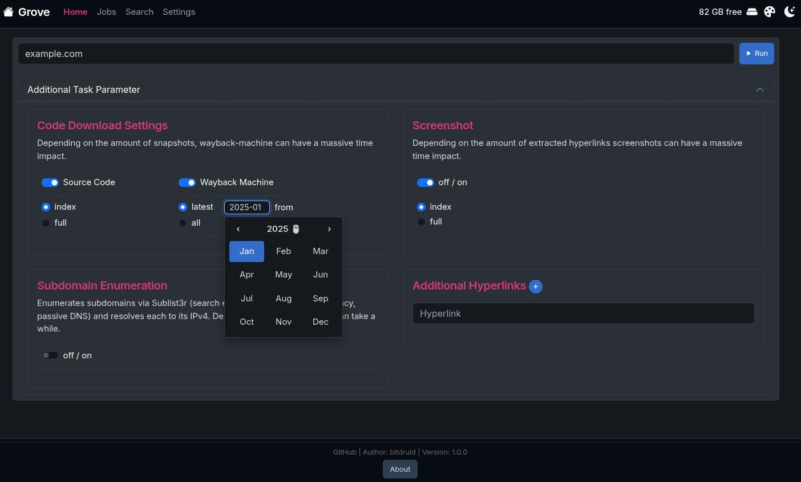
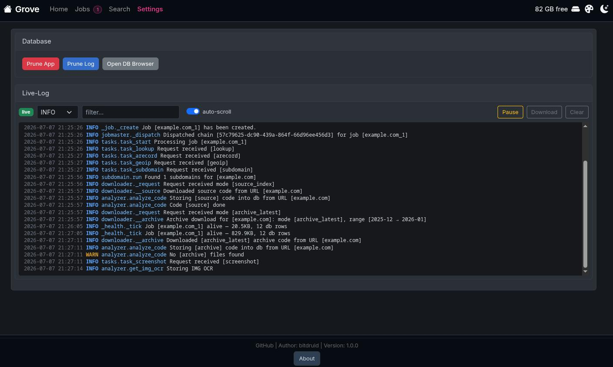
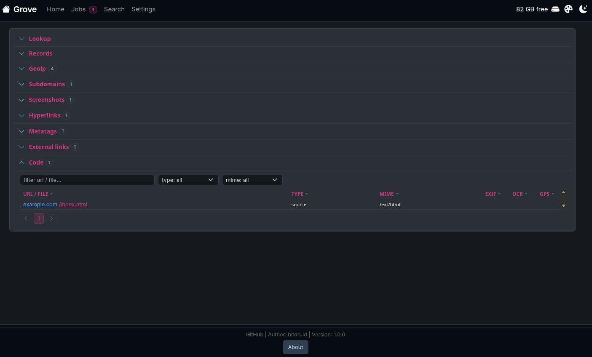

<div align="center">

# Grove

**Scrape those DOM-trees!**

[](https://hub.docker.com/r/bitdruid/grove)


[About](#about) • [What it does](#what-it-does) • [Quick start](#quick-start) • [Stack](#stack) • [Environment](#environment) • [Volumes \& persistence](#volumes--persistence) • [Local dev](#local-dev) • [Dependencies](#dependencies)

<a href="media/example1.jpg"></a>
<br>
<a href="media/example2.jpg"></a>
<br>
<a href="media/example3.jpg"></a>

</div>

___

## About

In an abandoned job in the past we were useing an at some point trashed php7 webscraper written by a colleague. After leaving this job i decided to revive this idea - first raising to php8. Fun note: this lead to [pywaybackup](https://github.com/bitdruid/python-wayback-machine-downloader) development, which was used in it's original state as [wayback-machine-downloader](https://github.com/hartator/wayback-machine-downloader) (thanks for the great project - o7). Later i decided to rewrite the idea of this scraper in python again. This code was just lying around for some years now. Fixed it up the last weeks to deploy. It's a "just for fun"-project.

So ignore it or use it - i don't mind. However if someone likes it and is asking for a feature i'm happy to help out.

This project running in docker is built to be deployed without any further services stacked - all included. Just build and run.

## What it does

OSINT-style web-scraping job runner. Submit a URL, it runs a pipeline (domain lookup, DNS, geoip, subdomains, source download, Wayback archive, screenshots, OCR, mail extraction), then presents the result in a browser UI:

- **Domain & network intel** — domain/IP whois + lookup, DNS A/AAAA records,
  geoip, subdomain enumeration.
- **Content download** — page source (`wget`) and Wayback Machine archive
  snapshots; extracts hyperlinks, meta tags, external links and email
  addresses; full-page screenshots (+ PDF).
- **File analysis** — OCR over downloaded images and PDFs; EXIF metadata
  (+ GPS coordinates, when present) pulled from images, audio, video and docs.
- **Browse** — a per-job result page groups every finding in collapsible
  sections, with a live log stream while the job runs.
- **Search** — full-text search across *all* jobs' downloaded files; each hit
  shows a highlighted snippet and opens into a syntax-highlighted file viewer
  that marks and scrolls to the match.
- **Offline export** — download a self-contained ZIP per job (static result
  page + all downloaded files) to keep or share without the server.

## Quick start

```bash
docker compose up --build
```

- Web UI → http://localhost:5000
- DB browser (sqlite-web) → http://localhost:5001 *(enabled by `SQLITE_WEB=1` in `compose.yml`)*

One self-contained image: Redis, the Celery worker, and the web process all
start from the entrypoint under `tini`. No external services to set up.

## Stack

- **Flask** + **Flask-SocketIO** — web UI and WebSocket/live-log transport.
- **Celery** + **Redis** — task queue; each tool is one task in a chain.
  Cancellation = `AsyncResult.revoke(terminate=True)`.
- **SQLite** — single file at `instance/db.sqlite3` (schema auto-created).
- **Whoosh** — per-job full-text index under `jobs/<id>/meta/index/`.

## Environment

The Redis wiring (`REDIS_URL`, `CELERY_*`, `SOCKETIO_MESSAGE_QUEUE`) is baked
into the image and points at the embedded broker — no need to set it. Point
`CELERY_BROKER_URL` off-localhost only if you want an external Redis.

User-facing toggles (set in `compose.yml`):

| Variable           | Default | Purpose                                                |
| ------------------ | ------- | ------------------------------------------------------ |
| `ENABLE_PROXY_FIX` | `1`     | `0` if not behind proxy. Honor `X-Forwarded-*` headers |
| `SQLITE_WEB`       | `1`     | `0` to disable sqlite-web db browser                   |
| `SQLITE_WEB_PORT`  | `5001`  | port for the db browser                                |

Reverse-proxy / sub-path setup: see [nginx.example.conf](nginx.example.conf).

## Volumes & persistence

**Nothing is mounted by default** — the image is self-contained, so job
artifacts and the DB live in the container's writable layer and are **lost on
`docker rm`**. Uncomment the `volumes:` block in `compose.yml` to persist them.

| Container path  | Holds                                                                                      |
| --------------- | ------------------------------------------------------------------------------------------ |
| `/app/jobs`     | Per-job artifacts: source-code, screenshots, zip, `meta/` (search index + Wayback csv/db). |
| `/app/instance` | SQLite DB (`db.sqlite3`) + rotating log (`grove.log`).                                     |

Keep the two **together** — the DB references job files by path, so wiping one
while keeping the other leaves dangling rows. Settings → **Prune App** clears
both consistently (**Prune Log** clears just the log table).

## Local dev

`start.sh` is the dev entrypoint: checks system deps, creates `.venv`, installs
Python deps, starts Redis as a daemon, runs the Celery worker, and launches the
web process in the foreground.

```bash
./start.sh
```

Requires Python 3.13 and `pacman` or `apt` for system packages. Stop the dev
Redis afterwards with `redis-cli shutdown`.

## Dependencies

- `requirements.txt` — top-level deps, loose versions (human-edited).
- `requirements.lock` — full `pip freeze`, pinned. **The image installs from
  this file** for reproducible builds.

To bump deps: edit `requirements.txt`, then regenerate the lock so the change is
picked up by the build —

```bash
./start.sh                                    # or: pip install -r requirements.txt --upgrade
./lock_new_requirements.sh --container grove  # freeze from a running container
./lock_new_requirements.sh --venv .venv       # ...or from a local venv
# commit both requirements.txt and requirements.lock
```

`torch` (pulled by `easyocr` for OCR) resolves to its **CPU** build via the
`--extra-index-url` header in `requirements.txt` — the `+cpu` wheel outranks
PyPI's CUDA one, so no multi-GB CUDA deps (keeps the image ~4 GB instead of
~11 GB). OCR runs in a background worker, so CPU is plenty. For GPU, drop that
`--extra-index-url` line and enable the nvidia block in `compose.yml`.
